# Fast Tetris

---

**Project Members:**

- Shaaf Salman (ID: 21L6083)
- Abdul Hadi (ID: 21L6077)
- Haider Khan (ID: 21L6067)

---

## Summary

This repository contains the codebase and documentation for the Fast Tetris project, which aims to develop a Genetic Algorithm (GA) for evolving players in a Tetris-like game environment.

### Table of Contents

1. [Code Structure and Implementation](#code-structure-and-implementation)
2. [GA Information](#ga-information)
3. [Path / Move Stretching Algorithm and Strategy](#path--move-stretching-algorithm-and-strategy)
4. [Version of the Code](#version-of-the-code)
5. [Future Implementation and Design](#future-implementation-and-design)

---

## Code Structure and Implementation

The project is built using Python, with Pygame being the major library used for game development. The code follows a structured approach to organization and implementation, with key components including classes for players, the game environment, rendering, and the Genetic Algorithm (GA).

### Base-Level Classes

The base-level classes include:
- **Grid:** Represents the game grid.
- **Block:** Defines the basic properties and behavior of a block.
- **Block subclasses (e.g., LBlock, IBlock, JBlock, etc.):** Inherit from the Block class and represent specific block shapes.
- **Position:** Manages the position of blocks on the grid.
- **Color:** Defines colors used for rendering.

### Intermediate-Level Classes

Intermediate-level classes include:
- **Player:** Represents an individual player in the game, with attributes such as height, lines cleared, holes, blockades, and score.
- **PathSearcher:** Generates all possible moves for players based on game state and player weights.

### Higher-Level Classes

Higher-level classes include:
- **Game:** Controls the game environment and logic, interacting with other classes such as HumanEmulator, GA, and PersistentGA.
- **HumanEmulator:** Facilitates human gameplay interaction.
- **GA:** Manages the Genetic Algorithm process for evolving players.
- **PersistentGA:** Resumes the evolution process from where it was last left off and stores generation data in files.

### Generation Data Storage

All data related to generations is stored in the Generation folder, with each generation having its own subfolder named Generation_X.

### Tree Structure

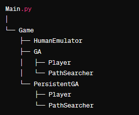     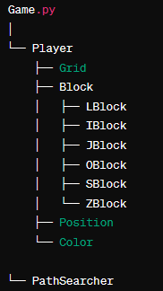


# GA Information


## **3.1 Introduction**

The Genetic Algorithm (GA) implemented in this project aims to evolve players in a Tetris-like game environment. Through iterative refinement of a population of players, the GA selects the fittest individuals based on predefined criteria, applies genetic operators such as crossover and mutation to generate offspring, and continues the evolution process indefinitely until the GA reaches a mature state capable of playing endlessly.

## **3.2  Summary of GA**

**Initialisation:** The GA initiates players with random weights for attributes such as height, lines cleared, holes, and blockades. These weights are crucial in determining player behaviour and strategy during gameplay.

## **3.3.1 Generation Process:**

 Each generation consists of 10 players, and the GA evolves them using mutation and crossover operators. The process involves selecting the top-performing players, performing crossover between parents, and introducing randomness through mutation.

## 3.3.2 Gene Information

Example of what a generation looks like:

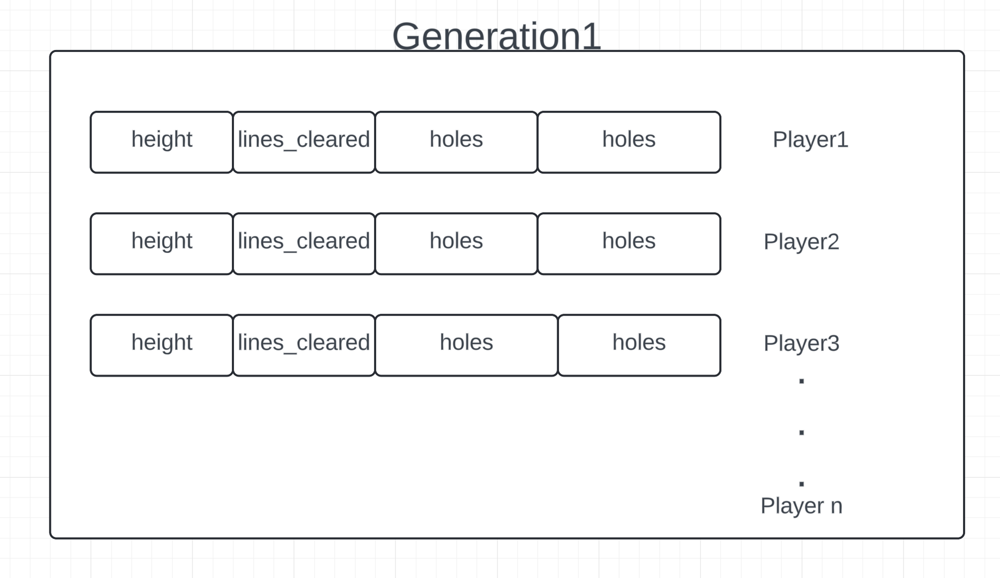
## **3.4 Configurable Environment:**

The GA's environment is configured using parameters specified in the **`config.py`** file, allowing for flexibility and customisation of the evolutionary process.
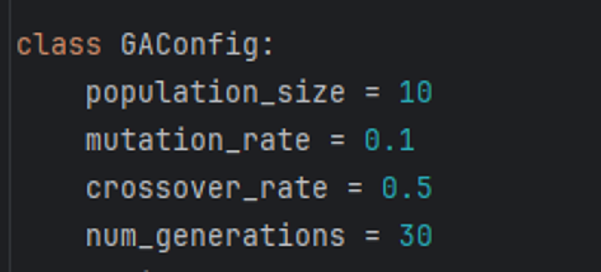

## **3.5.1  Very First Population**

The GA initialises the first generation with 10 players, assigning random weights for each player's attributes within specified ranges.
                    

### 3.5.2 Weights Sign Formation

```bash
     Lines Cleared -------------------------------------> positive
     Height        -------------------------------------> negative
     Blocakdes     -------------------------------------> negative
     Holes/Gaps    -------------------------------------> negative          
```

### 3.5.3 Score Calculation

```python

def initialize_population(self):
    self.population = []
    for _ in range(self.population_size):
        height_weight = uniform(-15.0, 0.0)
        lines_cleared_weight = uniform(0.0, 15.0)
        holes_weight = uniform(-15.0, 0.0)
        blockades_weight = uniform(-15.0, 0.0)
        
        
        player =Player(height_weight,lines_cleared_weight,holes_weight,blockades_weight)
        self.population.append(player)
```

## **3.6 Generation Process**

### **3.6.1 Player Moves:**

Each player in the generation is simulated in the game environment, making moves based on their assigned weights for attributes the moves calculation which will be discussed in detail afterwards.

### **3.6.2 Selection:**

The GA selects the top-scoring players from the current generation to proceed to the next generation.

### **3.6.3 Crossover:**

 Crossover is performed between selected parent players to generate offspring with combined traits. selects a random crossover point and then performs crossover between two best players in a population.
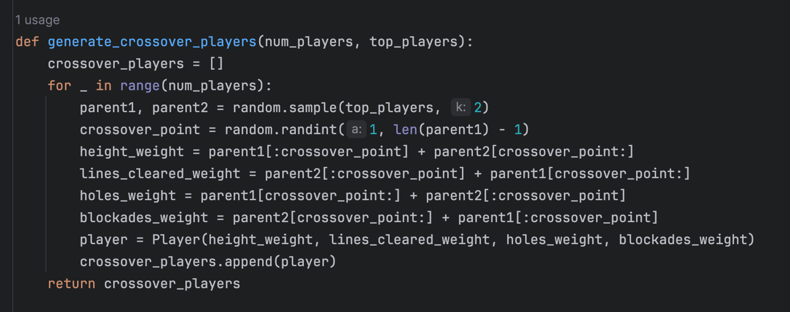

### **3.6.4 Mutation:**

Random mutation is applied to introduce variability and prevent premature convergence. This is done by randomly changing weights of a player’s attributes.

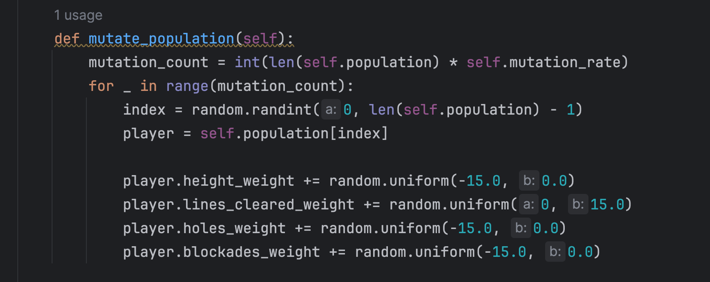

## **3.7 After Process**

After all players in the current generation have played, the GA initializes the next generation by selecting top players, performing crossover, and introducing random players.
# Path / Move Stretching Algorithm and Strategy

# **4. Path Searching Algorithm and Heuristic Calculation**

## **4.1 Continual**

After players of each generation play the game, the Genetic Algorithm (GA) proceeds to the player class, where it utilizes the path searcher class to generate all possible moves.

## **4.2 Path Searcher Class**

The path searcher class takes the game instance and player weights as input. It then calculates all possible moves based on the current game state and logic.

***what we have input form GA***

             

# “All weighs of the player and Game Instance”

## 4.2.3 All Possible Moves
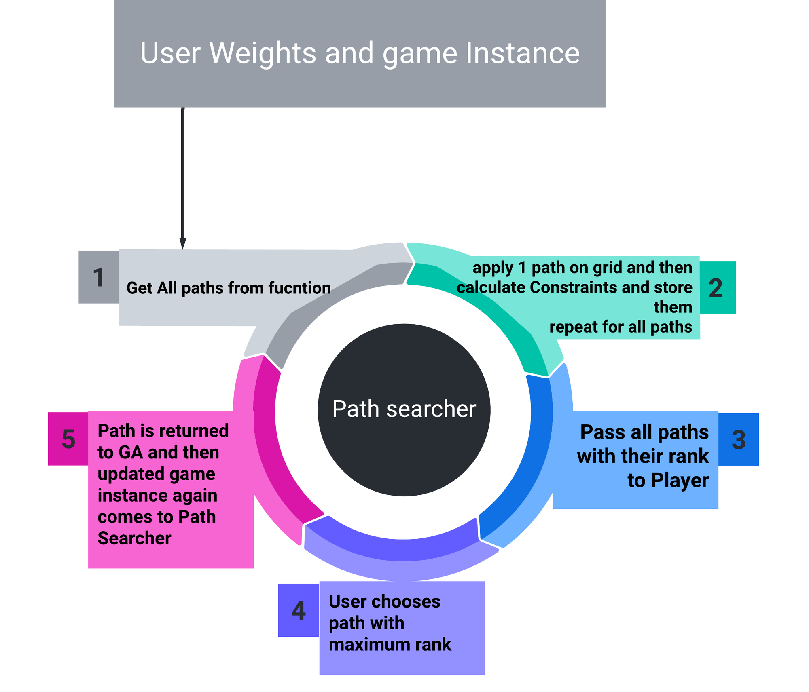
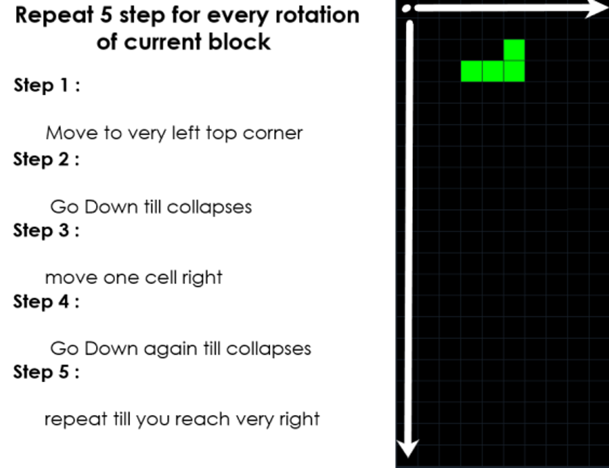
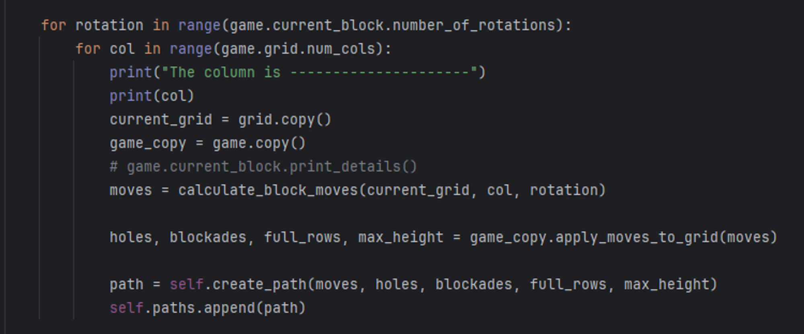

## **4.3 Gene Calculation**

After applying a move, the path searcher calculates various attributes, or genes, of the player. These include:

### **4.3.2 Holes**

according to game analytics and it plays a major role so by some research and break down we came up to 3 type of holes

 
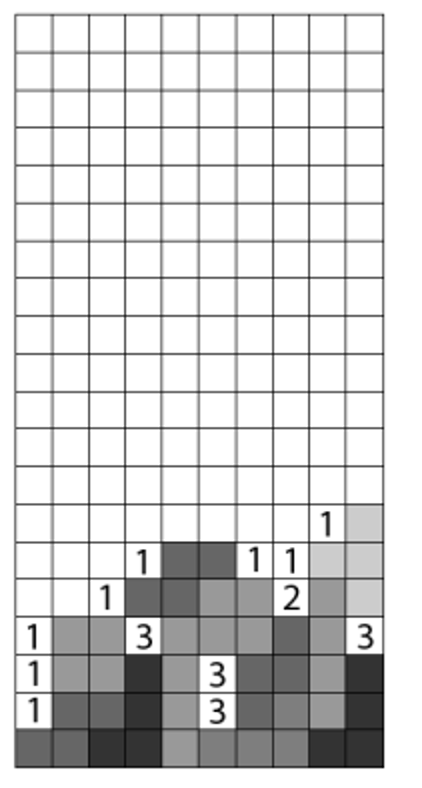

### **4.3.3 Blockades**

any cell of the block if acts to assist in creation of a block it is termed as a blockade

### **4.3.4 Height**

the maximum height of any tower in a grid after placing the block 

### **4.3.5 Lines Cleared**

lines cleared in the grid if that move is placed 

## **4.4 Rank Calculation**

The path searcher then computes the rank of each move based on the player weights, assigning a score to each move. It returns a list of paths ranked by score, allowing the player to choose the optimal move.


# Version of the Code

The current implementation performs well, achieving an average score of approximately 250 to 300. After around 10 generations, scores begin to exceed 800 to 1000, indicating the effectiveness of the GA in improving player performance over time.
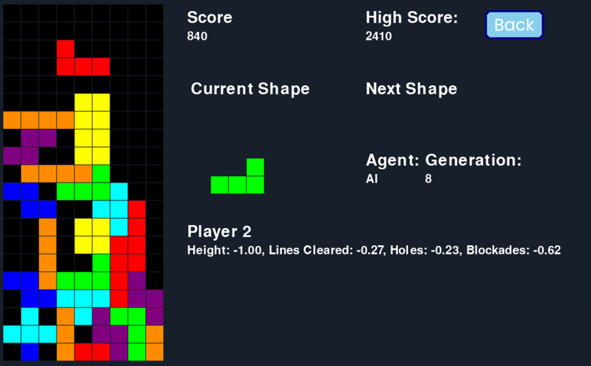

# Future Implementation and Design

we look forward to implement following in the code

## **5.1 A* Implementation**

In an ideal scenario, the GA would implement the A* algorithm to calculate all possible moves of the grid, treating it as a tree structure. This approach would provide more accurate and efficient path searching.

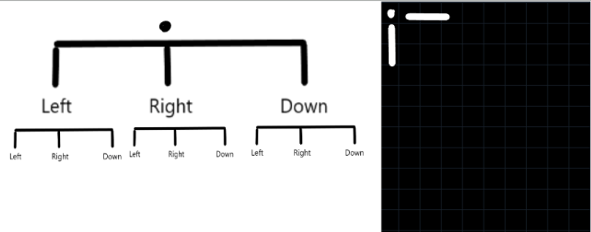
## **5.2 Next Block Storage Technology**

Future enhancements could involve extending the path searcher to calculate moves for both the current block and the next block. This improvement would enhance strategic planning and overall gameplay.


---
